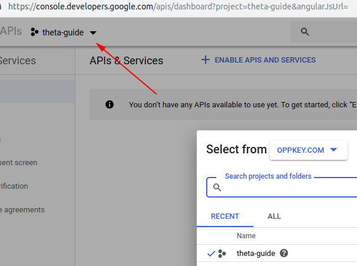
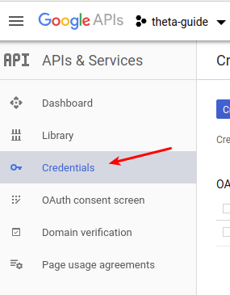
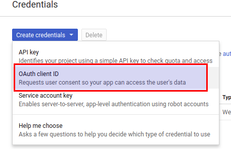
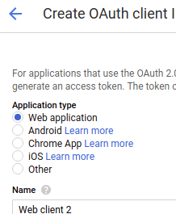
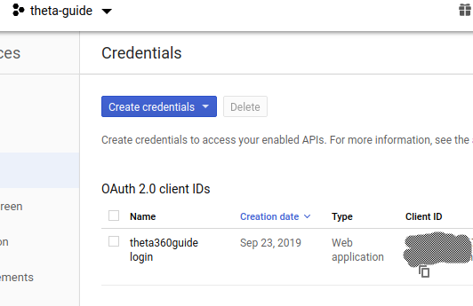
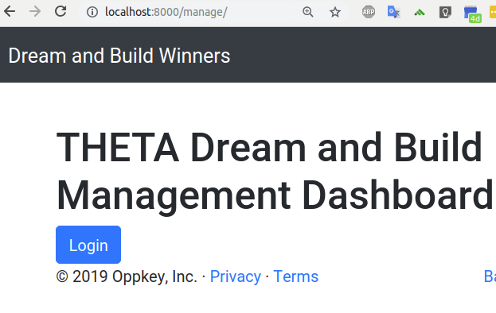
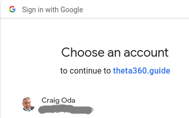
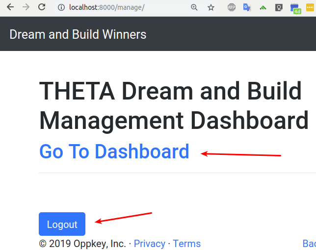

# Configure Django Social Authentication

* Python 3.7
* Django 2.2

## Usage

Must edit `local_settings.py` and include credentials for social logins.

## Setup

### Install Social Auth

   pip install social-auth-app-django

### console.developers.google.com

Go to https//console.developers.google.com and create new credentials.

Select Web application.

Under Authorized redirect URIs, add the following:

    http://localhost:8000/complete/google-oauth2/
    https://project-domain.com/complete/google-oauth2/

Replace `project-domain.com` with the URL of your project server.

### Settings.py

    # social auth configuration

    AUTHENTICATION_BACKENDS = (
        'social_core.backends.google.GoogleOAuth2',
        'django.contrib.auth.backends.ModelBackend',
    )

    LOGIN_URL = '/auth/login/google-oauth2/'

    LOGIN_REDIRECT_URL = '/manage/'
    LOGOUT_REDIRECT_URL = '/'
    SOCIAL_AUTH_URL_NAMESPACE = 'social'

    INSTALLED_APPS = [
        ...
        'social_django'
        ...
    ]

create a new file called `local_settings.py` and insert the following at the bottom of the
`settings.py` file to create a connection from `settings.py` to `local_settings.py`:

    try:
        from .local_settings import *
    except ImportError:
        pass

### local_settings.py

Put the values from Google into the constants below.

    SOCIAL_AUTH_GOOGLE_OAUTH2_KEY = 'GOOGLE_KEY'
    SOCIAL_AUTH_GOOGLE_OAUTH2_SECRET = 'SECRET'

### urls.py

    from django.contrib.auth.views import LogoutView
    ...

    urlpatterns = [
    path('admin/', admin.site.urls, name='administrator'),
    path('', include('social_django.urls', namespace='social')),
    path('', views_main.index, name='index'),
    path(
        'logout/',
        LogoutView.as_view(template_name=settings.LOGOUT_REDIRECT_URL),
        name='logout'
        ),
    path('manage/', views.manage, name='manage'),
    ]

### views.py

    def manage(request):
        return render(request, 'manage.html')

### template manage.html

The snippet below uses Bootstrap for styling.

    

            <h1>THETA Dream and Build Management Dashboard</h1>
    
            
    
            <h2>
                <a href="/admin/">    Go To Dashboard</a>
            
            </h2>
            

            
            <a class="btn btn-primary mt-5" href="">Logout</a>
            
            
            <a class="btn btn-primary" href="">
                    Login
                    </a>
            
        

### make and migrate models

   $ python manage.py makemigrations
   $ python manage.py migrate

### run server and test

   $ python manage.py runserver

